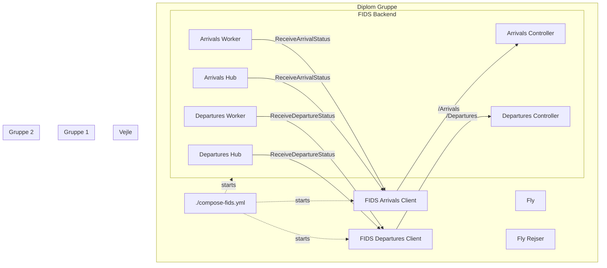

# FIDS



```powershell
    # Build
    docker compose -f .\compose-fids.yml build --no-cache
    
    # Start
    docker compose -f .\compose-fids.yml up -d
    
    # Stop and remove
    docker compose -f .\compose-fids.yml down
```

- After startup go to `http://localhost:5601` (Kibana dashboard)
- In Index pattern change `logstash-*` to `fids-*`
- Choose @timestamp in Time Filter field name
- Click Create
- Go to the Discover tab